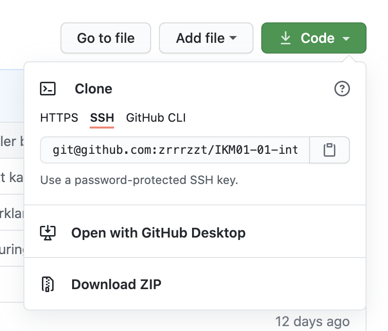

# Hente et repo til din lokale maskin

For å kunne jobbe med kode fra GitHub er det enklest å ha en lokal kopi

## Slik gjør du det

- Gå til repoet på GitHub [IKM01-01-intro-til-tdd-og-parprogrammering](https://github.com/zrrrzzt/IKM01-01-intro-til-tdd-og-parprogrammering)
- Trykk på den grønne knappen

- Velg å laste ned repoet som zip-fil
- Pakke filen på maskinen den og åpne VS Code i mappen 

