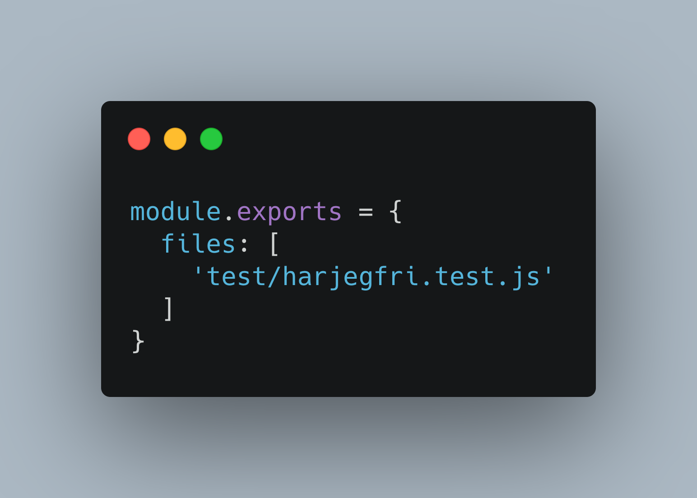

# Parprogrammering

Parprogrammering er at to personer koder sammen på en datamaskin.
Dette er en god metode for å få høyere kvalitet på koden, men det er også en kjempefin måte å dele kunnskap på og den er fin til å skape teamfølelse.

Parprogrammering fungerer like godt om begge er på samme nivå kompetansemessig som dersom det er stor forskjell.

Om man er flere enn to kalles det ofte [mobprogrammering](mobprogrammering.md)

## Hvordan gjør man det?

Den vanligste måten å gjennomføre parprogrammering er at man har en sjåfør og en navigatør.

- Sjåføren sitter ved tastaturet og er den som skriver testene og koden
- Navigatøren leser over koden og formulerer hva som skal gjøres
- Etter avtalt til bytter man rolle

Dere snakker mye sammen undervegs og på den måten passer man på at kunnskap blir delt og at dere har samme forståelse av problemet som skal løses.

Parprogrammering kan være ganske intenst og det er lurt å ikke legge opp til for lange sesjoner av gangen.

## Tips til hvordan man forbereder seg og gjennomfører en god økt

### 1. Forberedelser
  - Sett av tid, gjerne 2 - 4 timer
  - Sjekk hvordan dere har det. Trenger dere ta det rolig i dag? Er det andre hensyn å ta?
  - Lag en plan om hva dere vil oppnå i løpet av økten
  - Lag gode arbeidsforhold. Sitt godt. Se skjermen begge to.
### 2. Jobb tett sammen
  - Følg planen
  - Bruk TDD
  - Diskuter undervegs
### 3. Lær og lag et godt læringsmiljø
  - Forklar hva du gjør og hvorfor
  - Spør om du lurer på noe
  - Ingen forslag er dumme
### 4. Få en god arbeidsrytme
  - Bli enige om passende tidsintervaller
  - Ved TDD kan dere bytte når dere har skrevet fungerende gode og laget den neste testen som feiler
  - Alle små suksesser må feires :-) F.eks. alle grønne tester
### 5. Kommuniser effektivt
  - Vær åpne om dere faller av eller ikke er enige
  - Snakk rolig sammen
  - Vent med å påpeke eventuelle feil til sjåførern er ferdig, kanskje oppdager hen det selv
### 6. Elsk utfordringer
  - Det kan være vanskelig å samarbeide, se på det som læring
  - Snakk om hva som ikke funket og hvorfor
  - Snakk om hva som gikk bra og hvorfor

# Oppgave

Dere skal lage verdens kuleste funksjon. Det viktigste i verden er å vite når man har fri derfor skal dere utvikle funksjonen harjegfri.

Funksjonen skal svare 'ja' alle dager du har fri og 'nei' på dager du ikke har fri.

Grunnoppsettet for kode ligger i filen [lib/harjegfri.js](../lib/harjegfri.js) og testfil er klargjort på [tests/harjegfri.test.js](../tests/harjegfri.test.js)

For å endre testmiljøet til å bare bry seg om å teste den nye funksjonen må du også endre [ava.config.cjs](ava.config.cjs)

Dere kan prøve å lage deres egne brukerhistorier.

Hvis ikke kan dere følge de som er laget i [docs/brukerhistorier.md](brukerhistorier.md)

# Oppsummering

- Parprogrammering er en god måte å spre kompetanse på.
- Kommunikasjon er viktig.
- Det kan være ganske intenst, så husk å ta gode pauser.
- Er dere mange så kan det være lurt å sette sammen nye par med jevne mellomrom
- Parprogrammering krever trening, så ikke gi opp om det ikke fungerer med en gang.

Det finnes også gode metoder å løse problemer på dersom dere er mer enn to og kanskje også jobber sammen med personer som ikke er utviklere. En av disse heter [mobprogrammering](mobprogrammering.md)

# Kilder/videre inspirasjon

- https://gds.blog.gov.uk/2018/02/06/how-to-pair-program-effectively-in-6-steps/
- https://www.thoughtworks.com/insights/blog/10-ways-improve-your-pairing-experience