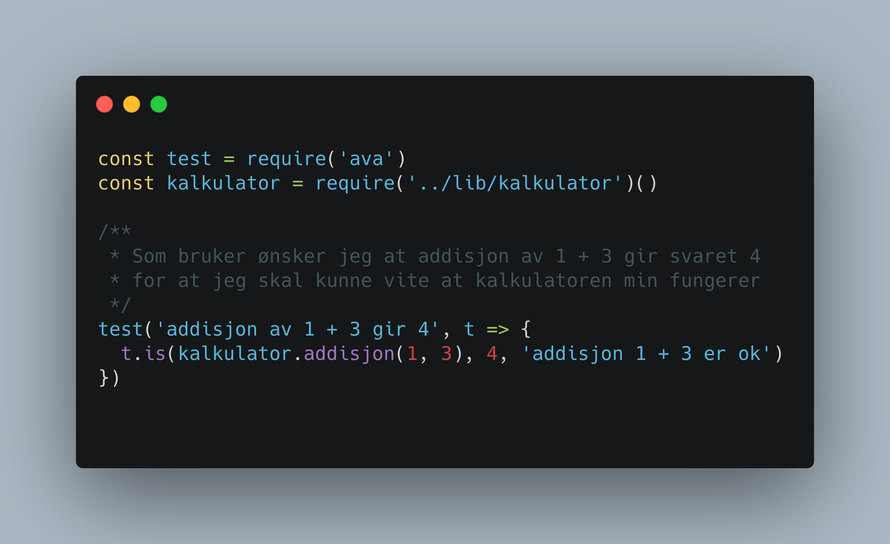
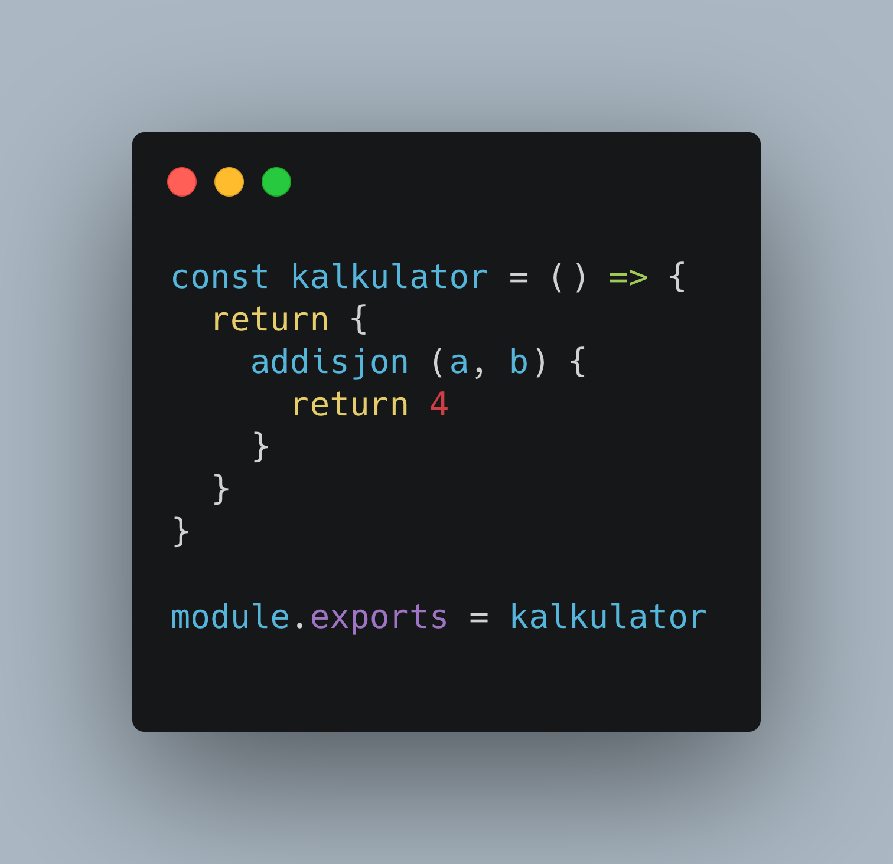
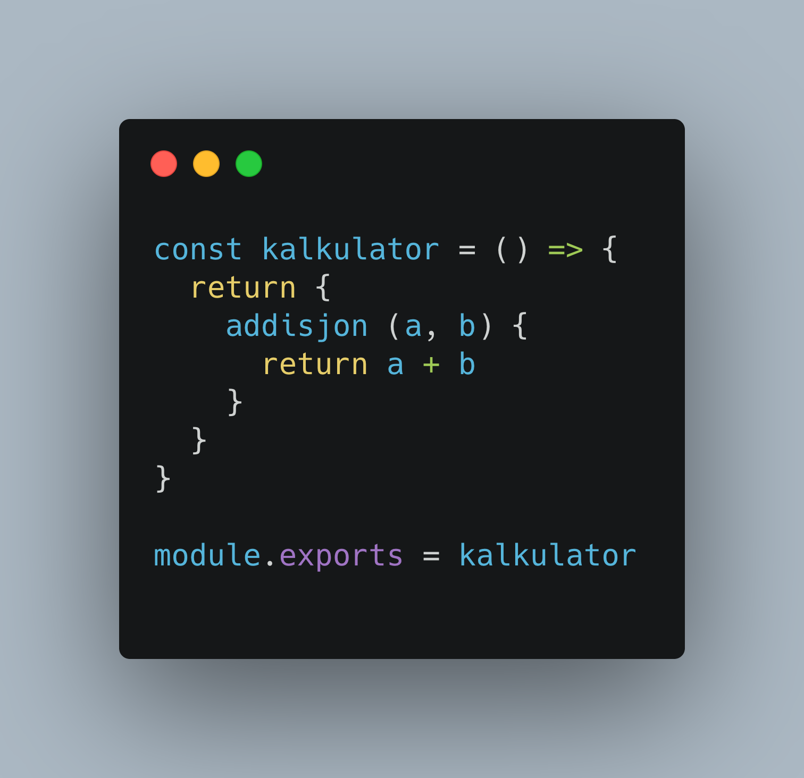
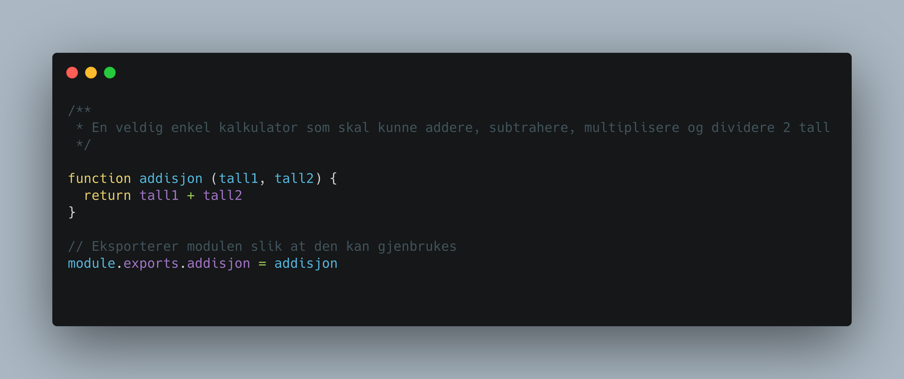

# TDD - Testdrevet utvikling

TDD, test-driven development, er en programmeringsteknikk hvor du skriver testene først og så koden.
I grove trekk består TDD av tre trinn som du gjentar i hele utviklingsløpet.

- Skriv en test som feiler
- Skriv den minste implementasjonen du kan av koden for å få testen til å bestå
- Refaktorer koden

## Et eksempel: en enkel kalkulator

Vi skal lage en kalkulator.
For å starte så enkelt som mulig bestemmer vi oss for at den skal kunne legge sammen 2 tall.
Vi ønsker å ha en funksjon for dette.

Testen sjekker at funksjonen tar imot to tall, 1 og 3. Så sjekker den at resultatet av dette blir 4.

Så skriver vi den minste implementasjonen vi kan komme på for at denne testen skal bestå.

Å skrive en funksjon som bare returnerer 4 får testen til å bestå.
Det kan virke dumt å gjøre noe så lite men nå vet du at denne testen vil passere så lenge funksjonen din returnerer 4 når du sender inn 1 og 3.
Da kan du trygt starte å refaktorere koden din fordi du vet at dersom du gjør det riktig vil testen fortsatt bestå.

Testen består fortsatt og da kan vi, dersom vi ønsker, refaktorere videre.
Det er for eksempel ikke så tydelig å lese koden og forstå hva a og b er.
Vi kan for eksempel erstatte de med tall1 og tall2, eller bruke det helt korrekte addend1 og addend2

## Oppgave

Koden vi har laget nå ligger i filen [lib/kalkulator.js](../lib/kalkulator.js).
Testene ligger i [tests/kalkulator.test.js](../tests/kalkulator.test.js)

Disse filene skal du nå jobbe videre med selv.
Oppgavene er at du skal implementere funksjonalitet for subtraksjon, multiplikasjon og divisjon i kalkulatoren.
Brukerhistoriene ligger som kommentarer i testfilen.

For å kjøre testene åpner du terminalen i VS Code (View => Terminal) og du skriver `npm test` for at den skal kjøre testen.

Tips: Om du vil testene skal kjøre hver gang du lagrer kan du bruke `npm run watch:test`.
Når du vil slå av automatikken bruker du tastekombinasjonen [control] + [c]. Det kommer en stygg feilmelding, men det er helt ok :-)

### Bonusoppgave

Vi ønsker å teste flere kombinasjoner av det å legge sammen tall.
Faktisk ønsker vi å teste for alle tall fra 1 til 100.
Men, å skrive over 100 tester er heldigvis ikke nødvendig.
Tester er funksjoner og funksjoner kan kalles av andre funksjoner.
Hvordan ville du løst dette?

# Sammendrag

TDD krever ofte litt endring av tankesett, men når man kommer inn i det virker det veldig naturlig.
Du flytter jobben med å tenke på hva koden skal gjøre til testene og deretter skriver du en av de mulige løsningen dette kan gjøres på. Deretter kan du endre koden i ettertid med litt større trygget.

For å få best mulig utbytte av testene bør de være
- Lesbare, så det fremgår tydelige hva du tester
- Isolerte, så du tester kun en liten del av koden ved hver test
- Grundige, så du kan avsløre edge-cases
- Tydelige, så man kan forstår formålet utfra å lese testene

## Veien videre

- TDD funker fint alene, men enda bedre med [parprogrammering](parprogrammering.md)

## Kilder/videre inspirasjon

- https://dev.to/wolfdominion/introduction-to-tdd-what-it-is-and-why-it-is-important-2hhf
- https://dev.to/rafinskipg/a-beginners-guide-to-tdd-javascript-2oj9
- https://www.pluralsight.com/guides/introduction-to-test-driven-development-in-javascript
- https://github.com/avajs/ava
- [_Test-Driven Development: By Example_ av Kent Beck](https://books.google.no/books?id=CUlsAQAAQBAJ&printsec=frontcover&dq=bibliogroup:%22The+Addison-Wesley+signature+series%22&hl=en&sa=X&ved=2ahUKEwipz4baoKfsAhXj-SoKHcs0Cy4Q6AEwB3oECAgQAg#v=onepage&q&f=false)
